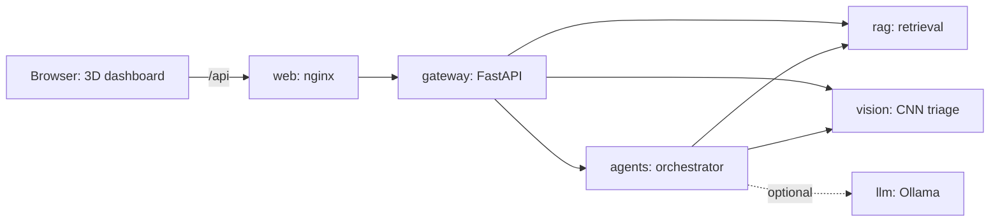

# Sentinel-X: AI Cyber Defense Platform

> **Designed and developed by NIKHIL CHARY SRIRAMOJU**

Sentinel-X is a major project that combines **AI/ML and cybersecurity**. A **CNN** inspects suspicious files, a **RAG** engine recalls threat intelligence, an **LLM** reasons over both, and **agentic AI** contains the incident, all running as **Docker** services and presented in a responsive **3D** dashboard.

**Live demo:** `https://nikhil-creat.github.io/sentinel-x/` (after you publish it with GitHub Pages, see [docs/DEPLOY_GITHUB_PAGES.md](docs/DEPLOY_GITHUB_PAGES.md))

## Features

| Area | What you get |
|---|---|
| 3D visuals | Hero network with AI core, drag-to-rotate six-layer architecture stack, global threat globe with animated attack arcs |
| Live console | Simulated event stream, risk index, sparkline, attack-surge button, JSON export |
| MITRE ATT&CK | Coverage matrix that lights up as events, scans, logs and incidents map to techniques |
| CNN lab | Turns any file into a byte-plot image, classifies malware families, entropy stats, region heatmap |
| RAG | 16-chunk threat knowledge base, TF-IDF retrieval, cited answers, refuses unsupported questions |
| Agentic AI | Six agents (Monitor, Planner, Analyst, Reasoner, Responder, Reporter), six incident scenarios, human approval gate, downloadable reports |
| Security toolkit | Phishing URL scanner, password strength estimator, log forensics analyser (all local) |
| Sentinel Copilot | Chat with tool intents, voice input and read-aloud on supported browsers |
| Command palette | `Ctrl+K` or `/` to jump anywhere or run any demo |
| Platform | Light and dark themes, installable PWA with offline shell, keyboard accessible, reduced-motion aware |
| Backend | FastAPI gateway, RAG, vision and agents services, hardened Docker Compose, optional local LLM through Ollama |

## Architecture



More detail is in [docs/ARCHITECTURE.md](docs/ARCHITECTURE.md), the API in [docs/API.md](docs/API.md) and the threat model in [docs/THREAT_MODEL.md](docs/THREAT_MODEL.md).

## Quick start

### Option 1: open the front end

Double-click `index.html`, or serve the folder:

```bash
python3 -m http.server 8000
# open http://localhost:8000
```

Everything works in the browser. Three.js and the fonts load from a CDN, so you need an internet connection the first time. Afterwards the service worker keeps the app available offline.

### Option 2: run the full stack with Docker

```bash
cp .env.example .env        # then set API_KEY to a long random string
docker compose up -d --build
# open http://localhost:3000
```

In the page, open the **Docker** section, enter `/` in **Connect the backend** and press **Connect**. The RAG search and the CNN lab now use your containers.

Optional local LLM for the agents:

```bash
docker compose --profile llm up -d
docker compose exec llm ollama pull llama3.2
# set LLM_URL=http://llm:11434 in .env, then: docker compose up -d agents
```

### Optional: train the PyTorch CNN

```bash
cd backend/vision
pip install torch numpy
python train.py             # writes model.pt, picked up automatically by the vision service
```

The training script uses synthetic byte-plot data so it runs anywhere. For a real evaluation, swap in a public malware image dataset such as Malimg, resized to 32 by 32 grayscale.

## Project layout

```
sentinel-x/
  index.html  404.html  manifest.webmanifest  sw.js  favicon.svg
  css/styles.css
  js/          core, api, hero, stack, globe, soc, vision, rag, agents, tools, copilot, docker, kb
  assets/      PWA icons
  backend/
    gateway/   FastAPI gateway: API key, rate limit, security headers
    rag/       TF-IDF retrieval service and knowledge base (data/kb.json)
    vision/    byte-plot classifier, optional PyTorch CNN (cnn.py, train.py)
    agents/    incident-response agents and scenarios
  web/         Dockerfile and hardened nginx config
  docker-compose.yml  .env.example
  docs/        architecture, API, threat model, GitHub Pages guide
  .github/workflows/ci.yml
```

## Honest scope

- The browser demos are **simulations**. The event stream, globe traffic and incident scenarios are generated, and the CNN lab uses a lightweight feature-based classifier so it works offline.
- The agent orchestrator is a plain Python state machine. It is structured so that it can be moved to LangGraph.
- Retrieval uses TF-IDF. The upgrade path is embeddings in a vector database with a reranker.
- The metrics on the page are **design targets**, not measured results.
- Containment actions run in **dry-run** mode and need human approval by default.

## Tech stack

HTML, CSS, JavaScript, Three.js, Python, FastAPI, NumPy, PyTorch (optional), httpx, Docker, Docker Compose, nginx, Ollama (optional), GitHub Actions.

## Security

See [SECURITY.md](SECURITY.md). Use security tooling only on systems you own or are authorised to test.

## Licence

MIT. Copyright (c) 2026 Nikhil Chary Sriramoju.

## Author

**Nikhil Chary Sriramoju**
GitHub: https://github.com/Nikhil-creat
LinkedIn: https://in.linkedin.com/in/nikhil-chary-sriramoju-95041b38a
